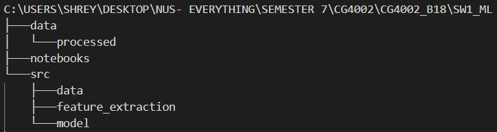

# CG4002_B18
Ay20/21 Capstone Project Group B18

## Table of Contents
* [1. Setting up](#1-setting-up)
    * [1.1. Prerequsites](#11-prerequisites)
* [2. Hardware](#2-hardware)
	* [2.1. Architecture](#21-architecture)
* [3. Comms Internal](#3-comms-internal)
	* [3.1. Architecture](#31-architecture)
* [4. Comms External](#4-comms-external)
	* [4.1. Architecture](#41-architecture)
* [5. Machine Learning Software](#5-Machine-Learning-Software)
	* [5.1. Architecture](#51-architecture)
* [6. Machine Learning FPGA Hardware](#6-Machine-Learning-FPGA-Hardware)
	* [6.1. Requirements](#61-requirements)
	* [6.2. Setup](#62-Setup)
	* [6.3. Usage on ultra96](#62-Usage-on-ultra96)
* [7. Dashboard Software ](#7-Dashboard-Software)
	* [7.1. Architecture](#71-architecture)
	* [7.2. Setup](#72-setup)
* [Appendix A: Product Scope](#appendix-a-product-scope)


## 1. Setting up
### 1.1 Prerequisites<br>
1. Git clone this repository, if you are using a zipped version, unzip it to view the contents
2. Ensure you have the relevant packages installed from the different subcomponents stated below

[&#8593; Return to Table of Contents](#table-of-contents)

<br/>

## 2. Hardware

### 2.1. Setup

1) Open Beetle_with_Position file in Arduino IDE
2) Click "Upload"
3) See the data by clicking "Serial Monitor" (Magnifying glass at the top right of the IDE)

## 3. Comms Internal

### 3.1. Setup Bluno for full run

1) Open [/comms_internal/combine/combine.ino](/comms_internal/combine/combine.ino) in Arduino IDE
2) Upload Code On to Bluno

### 3.2. Check MAC address of Bluno

1) sudo hcitool lescan
2) locate device with name "bluno"
3) Record the MAC address to be used in dancer_client.py

## 4. Comms External

### 4.1. Requirements
Ensure pip3 is installed in your system.
To install pip3: `apt-get install python3-pip`

On system with local database where [/comms_external/FINAL/laptop-sql.py](/comms_external/FINAL/laptop-sql.py) is run, ensure all the requirements are installed by running:
`pip3 install -r laptop-sql_requirements.txt`

On dancers' laptop where [/comms_external/FINAL/dancer_client.py](/comms_external/FINAL/dancer_client.py) is run, ensure all the requirements are installed by running:
`pip3 install -r dancer_client_requirements.txt`

On Ultra96, git clone this project. Inside the realtime_eval directory where [/realtime_eval/ultra96_client.py](/realtime_eval/ultra96_client.py) is run, ensure all the requirements are installed by running:
`pip3 install -r ultra96_client_requirments.txt`

The requirement files can be found here:
1. [/dancer_client_requirements.txt](/dancer_client_requirements.txt)
2. [/ultra96_client_requirements.txt](/ultra96_client_requirements.txt)
3. [/laptop-sql_requirements.txt](/laptop-sql_requirements.txt)

### 4.2. Running ultra96_client.py
1. Inside the realtime_eval directory, [/realtime_eval/ultra96_client.py](/realtime_eval/ultra96_client.py) run the following command:
`python3 ultra96_client.py [IP address of evaluation server] [Port number to connect with for evaluation server]`
2. Enter the port number for SQL and Ultra96 socket connection. Any port that's free can be used. The same port number has to be used for laptop-sql.py afterwards
3. Enter the port number of laptop and Ultra96 socket connection. Any port that's free can be used. The same port has to be used for dancer_client.py afterwards.
4. Enter 3 for number of dancers under evaluation mode.
5. Start the evaluation server after step 4. The secret key for evaluation server is "abcdefghijklmnop" without the quotation marks.
6. Press enter when prompted on ultra96_client.py after the evaluation server has started.

### 4.3. Running laptop-sql.py
1. Inside the directory with laptop-sql.py on your local machine where the database is hosted, run the following command:
`python3 laptop-sql.py`
2. When prompted for the port number for connection to Ultra96, enter the same port number that was given in step 2 under Running Ultra96 Client section.

### 4.3. Running dancer_client.py
1. Inside the directory with dancer_client.py, run the following command:
`python3 dancer_client.py`
2. It will prompt for the dancer number. After discussing with the 3 dancers, each dancer should take on an unique number from 1 to 3. Enter this unique dancer number
3. There are 6 set of gloves for dancing labelled a to f. Enter the glove letter being used by the dancer in lower case and press enter.
4. Finally, the dancer will have to enter the port number for the laptop to Ultra96 client connection. This port number must be the same as the one provided in step 3 under Running Ultra96 Client section.

All connections will be up and the system will be ready.


## 5. Machine Learning Software

### 5.1. Requirements

Pytorch + Ignite for MLP

Scikit-learn for Extra Trees Classifier 

### 5.2. Setup

1. The Machine Learning code is available in the sw1_ml folder with the following directory structure-



2. The data sub-directory stores processed data used for the individual subcomponent test.

3. The notebooks sub-directory stores the implementation of the various models

4. The src folder stores the various utility files used for processing data, feature extraction as well as the different Machine Learning models.

### 5.3. Usage

Run the notebook file step by step to process the relevant dataset, train the model and create a confusion matrix

## 6. Machine Learning FPGA Hardware

### 6.1. Requirements:

Vivado + Vivado HLS 2019.2

Pynq OS on Ultra96 board

### 6.2. Setup
1) HLS projects are stored in the path [/hardware_FPGA/Ultra96/Vivado/vivadoHLS](/hardware_FPGA/Ultra96/Vivado/vivadoHLS). They contain zip files that can be imported into HLS and be exported to a IP that can be imported in Vivado. The algorithm for the models are stored in mlpHLS.cpp in the zip file.

2) The Vivado project is stored in [/hardware_FPGA/Ultra96/Vivado/vivadoHLS/CG4002_B18\hardware_FPGA\ultra96\Vivado\MLPvivado.xpr.zip](/hardware_FPGA/Ultra96/Vivado/vivadoHLS/CG4002_B18\hardware_FPGA\ultra96\Vivado\MLPvivado.xpr.zip). This project archive can be imported from Vivado.
Click open block diagram and import the mlpHLS IP file generated bu Vivado HLS,and generate a bitstream

3) Scripts to export and study the algorithms are in[/hardware_FPGA/Ultra96/Vivado/vivadoHLS/CG4002_B18\hardware_FPGA\Notebooks](/hardware_FPGA/Notebooks)

### 6.2 Usage on ultra96
Helper functions are in
[\realtime_eval\MLP_predict_fpga.py](\realtime_eval\MLP_predict_fpga.py)
E.g to program the FPGA with the bitstream ETC_Start() can be called, and then ETC_Predict(inputs) can be called to get prediction.

## 7. Dashboard Software

### 7.1. Architecture
The architecture of the dashboard and an in depth explanation of each feature component can be viewed in the Final Report Document under Section 5.2.1 Dasboard - Software Engineering Aspect.

### 7.2. Setup

1) Ensure that the latest node package manager is installed. If you are using ubuntu, you can use the command ```sudo apt install nodejs``` and ```sudo apt install npm```. Check the version using ```nodejs -v```.
2) Change directory to ```/dashboard/dancedance/``` and run ```npm install``` to install the node module dependencies required for the front-end dashboard.
3) Change directory to the node server ```./api/``` and run ```npm install``` to install the node module dependencies required for the back-end server.
4) Once again, change directory back to the front-end via ```./dancedance/``` and run ```npm run dev```. This command will run both React as well as the node server at the same time using npm-watch library.
5) In order for the back end database to work, install MySQL using the command ```sudo apt install mysql-server``` and ```sudo mysql_secure_installation``` to easily set up a new MySQL server if you haven't done so.
6) Import the database ```toAws.sql``` found in ```./dashboard```
7) You should be able to register your very own account and log into the dasboard!
8) To simulate sensor data being displayed onto the evaluation mode tab, change directory to ```./dashboard/api/``` and run ```python sendingDataSimulator.py```. This will populate your Predictions and RawSensorData table in the database, and you should be able to view the evaluation feature with data pouring in.
9) Alternatively, [visit this website which this dashboard is currently being hosted!](http://ec2-3-92-0-213.compute-1.amazonaws.com:3000/)
